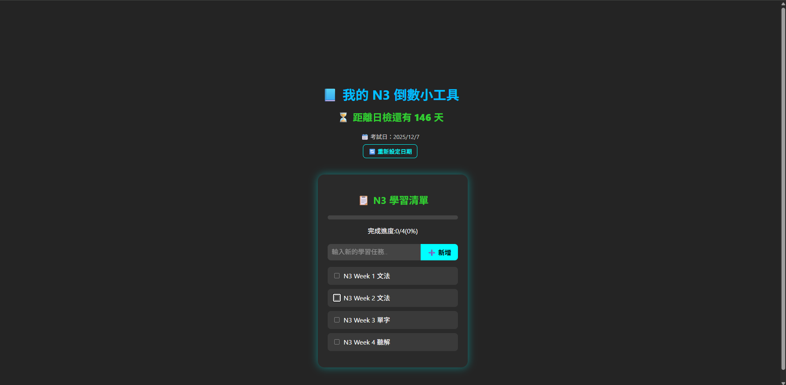
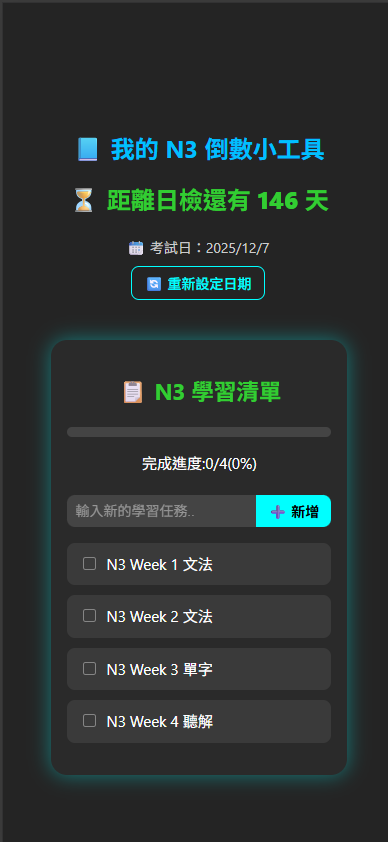

# 📋 N3 倒數進度追蹤小工具（React）

用 React 製作的學習小工具，幫助自己準備 JLPT N3 時管理考試倒數天數與學習進度。支援手機操作、自訂任務、勾選追蹤、狀態儲存等功能，適合考生日常學習使用或作為前端作品展示。

---

## ✨ 功能特色

- 📅 **可自訂考試日期**：第一次進入會要求設定日檢日期，之後會自動記住
- ⏳ **自動倒數計算剩餘天數**
- 📋 **學習清單勾選追蹤**：可新增、刪除任務，打勾代表完成
- 💾 **資料儲存於 localStorage**，不怕重整遺失
- 🔄 **可隨時重新設定考試日**
- 📱 **RWD 手機版支援**：在手機上也能清晰操作
- 🌈 **簡潔 UI + 動畫**：包含滑入、發光、勾選特效

---

## 🛠️ 使用技術

| 技術         | 說明                           |
|--------------|--------------------------------|
| React        | 使用 `useState`、`useEffect` 管理互動與資料 |
| Vite         | 快速建立 React 專案             |
| CSS          | RWD 響應式設計、動畫、美化           |
| LocalStorage | 前端儲存使用者輸入資料與狀態            |

---

## 📷 畫面預覽



## 手機

---

## 🚀 專案安裝與執行

```bash
# 安裝套件
npm install

# 啟動開發伺服器
npm run dev
